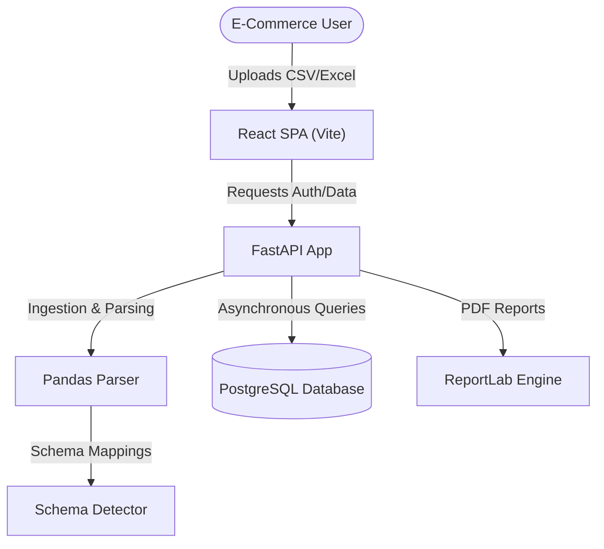

# CustomerIQ 🚀
> Professional Multi-Tenant Business Intelligence & Customer Growth Analytics Platform

[](https://opensource.org/licenses/MIT)
[](https://react.dev)
[](https://fastapi.tiangolo.com)
[](https://www.typescriptlang.org)
[](https://www.postgresql.org)

CustomerIQ is a professional business intelligence platform designed to ingest transactional dataset logs (CSV/Excel), auto-detect table schemas, map database fields, and render detailed customer segments, product performance leaderboards, monthly sales curves, and automated, rule-based growth recommendations.

---

## ⚡ Key Features

* **Secure Multi-Tenant Auth**: JWT-token based session auth featuring custom user and admin security role scopes.
* **Bulk Dataset Ingestion**: Dynamic CSV and Excel ingestion pipeline using Pandas and high-efficiency chunked bulk insertions (100k+ rows) into PostgreSQL.
* **Schema Auto-Detection**: Heuristic-based schema scanner mapping upload columns to system fields (`customer_id`, `revenue`, `purchase_date`, etc.).
* **Sales & Behavior Analytics**: Dynamic interactive area charts showing monthly sales trends, purchasing hour distributions, weekday activity charts, and seasonal splits.
* **Customer Segments Workspace**: In-depth metrics covering CLV, returning customer rates, gender splits, age distributions, and regional country logs.
* **Gamified Leaderboards**: Duolingo-style animated top 3 podiums and detailed contribution tables for customers, products, categories, and countries.
* **AI Business Advisor**: Rule-based growth evaluator producing custom opportunity scores and actionable step-by-step implementation playbooks.
* **PDF Report Compilation**: On-the-fly professional PDF compilation using ReportLab for Business Health and Growth Strategy exports.

---

## 🛠️ Technology Stack

| Component | Technology | Description |
| :--- | :--- | :--- |
| **Frontend** | React 18, Vite, TypeScript | Modern, high-performance UI shell. |
| **Styling** | Tailwind CSS, Framer Motion | Sleek dark-mode glassmorphism and animations. |
| **Charts** | Recharts, Lucide Icons | Fluid data visualizations and UI icons. |
| **Backend** | FastAPI, Python 3, Uvicorn | Asynchronous high-performance REST API. |
| **ORM** | SQLAlchemy 2.0 (Async), Asyncpg | Asynchronous connection pool & query engine. |
| **Data Engine** | Pandas, Openpyxl | Column parsing, cleanups, and file reading. |
| **Reports** | ReportLab | Server-side PDF generation. |
| **Security** | JWT (Jose), Passlib (Bcrypt) | Token generation and password hashing. |

---

## 📐 Architecture & Flow



---

## 📂 Folder Structure

```
customeriq/
├── backend/
│   ├── app/
│   │   ├── routers/          # API route endpoints (auth, datasets, analytics)
│   │   ├── services/         # Business logic engines (reports, analytics, recommendations)
│   │   ├── config.py         # Pydantic Settings schema
│   │   ├── database.py       # Asynchronous engine and session maker
│   │   ├── main.py           # Application startup & routes registration
│   │   ├── models.py         # SQLAlchemy Base models schema
│   │   └── schemas.py        # Pydantic validation schemas
│   ├── requirements.txt      # Python backend packages
│   └── .env                  # Configuration variables (gitignored)
├── frontend/
│   ├── src/
│   │   ├── assets/           # Static image assets and icons
│   │   ├── components/       # Layout, Sidebar, and Topbar shells
│   │   ├── context/          # Global AuthContext provider
│   │   ├── lib/              # API clients and utilities
│   │   ├── pages/            # Dashboard views (Overview, Analytics, Advisor, etc.)
│   │   ├── App.tsx           # Route hierarchies setup
│   │   └── main.tsx          # Render tree root
│   ├── tailwind.config.js    # Tailwind configuration
│   └── package.json          # Node dependencies
├── datasets/                 # Sample transaction datasets for testing
├── docs/                     # Technical specifications and roadmap documents
└── .gitignore                # Global gitignore parameters
```

---

## ⚙️ Environment Variables

### Backend Configuration (`backend/.env`)
Create a `.env` file inside the `backend/` directory:

```env
DATABASE_URL=postgresql+asyncpg://<username>:<password>@<host>:<port>/customeriq
JWT_SECRET=your_jwt_secret_key_here
ACCESS_TOKEN_EXPIRE_MINUTES=60
ALLOWED_ORIGINS=http://localhost:5173,http://127.0.0.1:5173
```

---

## 🚀 Installation & Setup

### Prerequisites
* **Python 3.10+**
* **Node.js 18+**
* **PostgreSQL Database**

### 1. Database Setup
Create an empty database in PostgreSQL named `customeriq`:
```sql
CREATE DATABASE customeriq;
```

### 2. Backend Setup
1. Navigate to the backend directory:
   ```bash
   cd backend
   ```
2. Create and activate a Python virtual environment:
   ```bash
   python -m venv venv
   # On Windows:
   .\venv\Scripts\activate
   # On Linux/macOS:
   source venv/bin/activate
   ```
3. Install backend dependencies:
   ```bash
   pip install -r requirements.txt
   ```
4. Start the backend development server (automatic migrations run on startup):
   ```bash
   uvicorn app.main:app --reload
   ```
The backend API documentation will be available at `http://127.0.0.1:8000/docs`.

### 3. Frontend Setup
1. Navigate to the frontend directory:
   ```bash
   cd ../frontend
   ```
2. Install npm packages:
   ```bash
   npm install
   ```
3. Boot the Vite development server:
   ```bash
   npm run dev
   ```
The React frontend dashboard will open at `http://localhost:5173`.

---

## 🔌 API Overview

* **Authentication (`/api/auth`)**
  * `POST /register`: Registers a new workspace user.
  * `POST /login`: Log in to retrieve a JWT bearer token.
  * `GET /me`: Get authenticated user profile details.
* **Datasets (`/api/datasets`)**
  * `POST /upload`: Uploads a CSV/Excel file, runs schema mappings, and chunk-inserts records.
  * `GET /`: Lists all uploaded datasets for the current tenant.
  * `DELETE /{dataset_id}`: Purges a dataset and cascades to wipe orders, products, and customers.
* **Analytics (`/api/analytics`)**
  * `GET /{dataset_id}`: Returns aggregated sales, behavior, and regional analytics.
  * `GET /{dataset_id}/insights`: Compiles automated strategic insights.
  * `GET /{dataset_id}/rankings`: Compiles leaderboard podiums.
  * `GET /{dataset_id}/recommendations`: Returns AI opportunity scores and strategic recommendations.
  * `GET /{dataset_id}/reports/download?type=health|growth`: Streams compiled PDF reports.

---

## 🖼️ Screenshots

> Screenshots will be added after deployment.

---

## 🔮 Future Improvements
- [ ] Add ML-based customer churn prediction and user purchase affinity tags.
- [ ] Implement multi-dataset cross-comparison metrics overlays.
- [ ] Support live data sync integrations (Shopify, Stripe webhook connectors).
- [ ] Introduce custom email template editors for re-engagement strategies.

---

## 👥 Author
Developed and maintained by **Neeraj Mann** for the CustomerIQ Business Intelligence suite.

---

## 📄 License
This project is licensed under the MIT License - see the [LICENSE](LICENSE) file for details.
